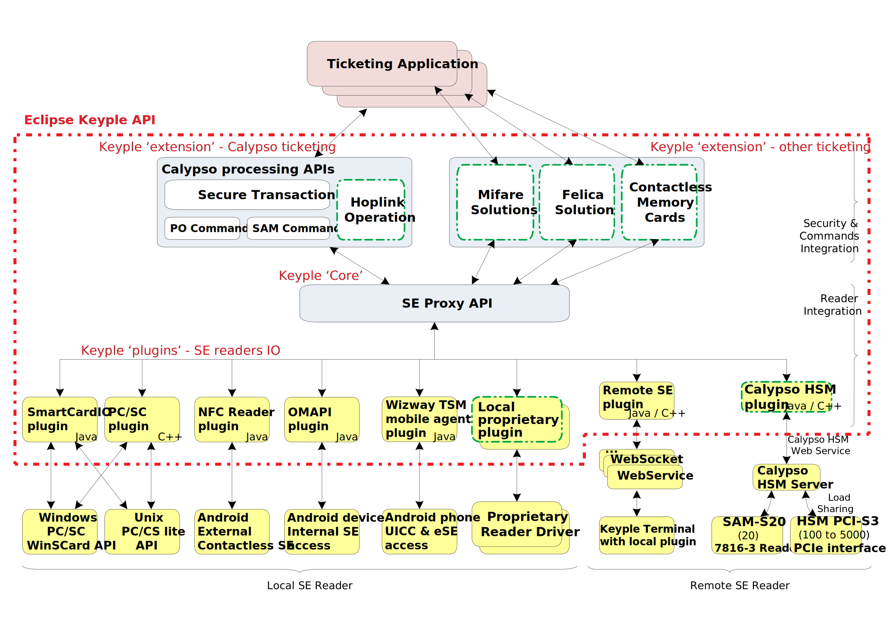
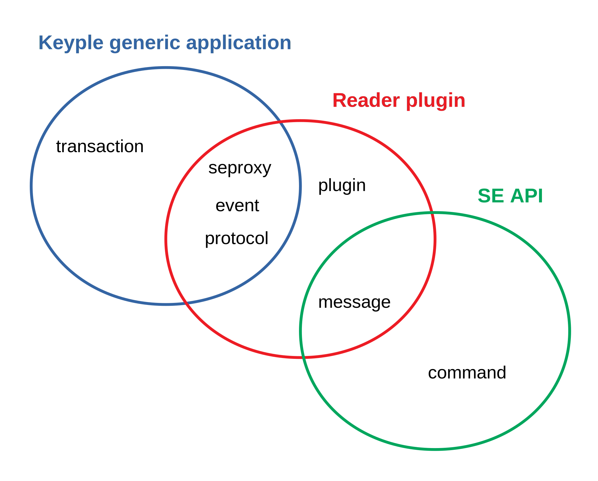
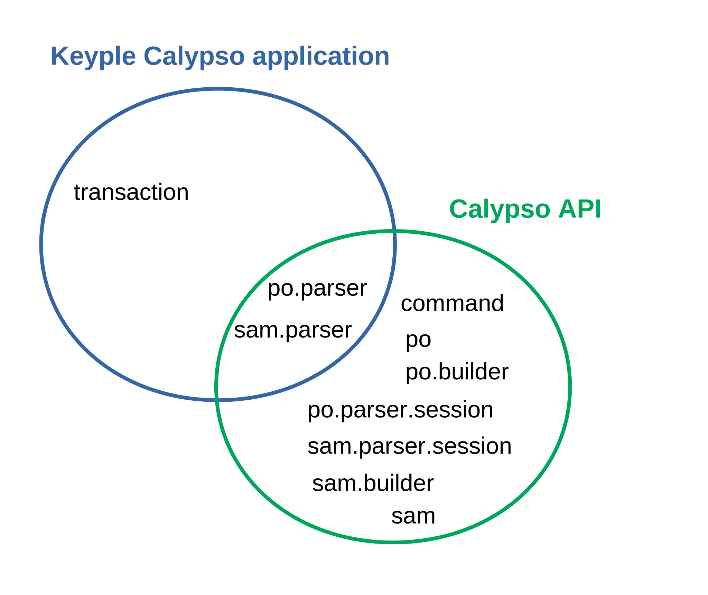

# 'Eclipse Keyple' Java implementation

This is the temporary repository for the Java implementation of the 'Eclipse [Keyple](https://keyple.org/)' API.
- The Eclipse Foundation is currently checking the IP of these elements.
- In March 2019, the Java source code of Keyple will be transfered to the repository manage by the Eclipse foundation https://github.com/eclipse/keyple-java.

## Global Architecture of Keyple



The API is currently divided in two major layers:
- The ‘Keyple Core' : a Secure Element Proxy API which allows managing SE readers in a generic way, whaterver the reader driver or environment, and for standalone or distributed solution.
- A ‘Calypso Keyple extension' : a high level Calypso Processing API allowing to operate commands with a Calypso Portable Object, and to manage a secure Calypso transaction.
Dedicated reader’s plugins have to be implemented in order to interface the SE Proxy API with the specific reader’s drivers.

## Supported platforms
- Java SE 1.6 compact2
- Android 4.4 KitKat API level 19

## keyple-java repositories structure

- Modules that are provide as artifacts
  - keyple-core: source and unit tests for the SeProxy module.
  - keyple-calypso: source and unit tests for the Calypso library.
  - keyple-plugin: source and unit tests for the different plugins: smartcard.io PC/SC, Stub, Android NFC, Android OMAPI, etc.
- developer support, testing
  - example: source for Keyple implementation examples, generic or Calypso specific.
  - integration: source for the integration code (SDK).

## Keyple features and corresponding packages

Keyple features global for any Secure Element solution:

| Features                                     | Packages  |
| -------------------------------------------- |-------------|
| Selections of Secure Elements (high level API) | org.eclipse.keyple.**transaction** |
| Management of SE readers | org.eclipse.keyple.**seproxy** |
| Notifications of reader plug/unplug, of SE insertion/remove<ul><li>definition of automatic selection request in case of SE insertion on an Observable Reader.</li></ul> | org.eclipse.keyple.seproxy.**event** |
| Communication protocols filters (setting for contactless/contacts SE Reader) | org.eclipse.keyple.seproxy.**protocol** |
| Reader plugins implementation support <ul><li>Utility classes providing generic processing for SE Reader Plugins</li></ul> | org.eclipse.keyple.seproxy.**plugin** |
| Transmition of grouped APDU commands to a SE Reader (low level API) | org.eclipse.keyple.seproxy.**message** |
| SE specific library implementation support <ul><li>generic API to build a SE specific commands library</li></ul> | org.eclipse.keyple.**command** |

Keyple features defined to support the Calypso solution:

| Features                                     | Packages  |
| -------------------------------------------- |-------------|
| Calypso Portable Object commands and secure transaction management <ul><li>high level API, commands’ settings limited to functional parameters</li><li>Calypso SAM (Secure Module) operations automatically processed</li></ul> | org.eclipse.keyple.calypso.**transaction** |
| Calypso PO responses data parsing | org.eclipse.keyple.calypso.command.**po.parser** |
| Calypso SAM responses data parsing | org.eclipse.keyple.calypso.command.**sam.parser** |
| Calypso PO & SAM commands' sets<ul><li>high level API, low level API, commands’ settings include technical parameters specific to Calypso PO revisions or Calypso SAM revisions</li></ul> | <ul><li>org.eclipse.keyple.calypso.**command**</li><li>org.eclipse.keyple.calypso.command.**po**</li><li>org.eclipse.keyple.calypso.command.**po.builder**</li><li>org.eclipse.keyple.calypso.command.**po.parser.session**</li><li>org.eclipse.keyple.calypso.command.**sam.parser.session**</li><li>org.eclipse.keyple.calypso.command.**sam.builder**</li><li>org.eclipse.keyple.calypso.command.**sam**</li></ul> |

## Keyple packages and corresponding usages
The packages to import in order to implement a ticketing **application**, a reader **plugin**, or a **SE library** to manage a specific solution.

- generic to any SE solution



- specific to Calypso



## JARs
When moved to the Eclipse repository, the Eclipse Keyple artifacts will be published on Maven. Pending temporary artifacts could be downloaded here:

- Keyple modules:
  - **'Keyple Core module' JAR**:  [https://calypsonet.github.io/keyple-java/develop/jars/keyple-core-1.0.0-RC4.jar](https://calypsonet.github.io/keyple-java/develop/jars/keyple-core-1.0.0-RC4.jar)
  - **'Keyple Calypso Library JAR'**: [https://calypsonet.github.io/keyple-java/develop/jars/keyple-calypso-1.0.0-RC4.jar](https://calypsonet.github.io/keyple-java/develop/jars/keyple-calypso-1.0.0-RC4.jar)
- Keyple plugins:
  - **'Keyple PC/SC plugin JAR'**: to manage PC/SC readers on a PC environment supporting the # javax.smartcardio API[https://calypsonet.github.io/keyple-java/develop/jars/keyple-plugin-pcsc-1.0.0-RC4.jar](https://calypsonet.github.io/keyple-java/develop/jars/keyple-plugin-pcsc-1.0.0-RC4.jar)
  - **'Keyple NFC Android plugin AAR'**: to operate the contactless reader of an Android Environment supporting the android.nfc API [https://calypsonet.github.io/keyple-java/develop/jars/keyple-plugin-android-nfc-1.0.0-RC4.aar](https://calypsonet.github.io/keyple-java/develop/jars/keyple-plugin-android-nfc-1.0.0-RC4.aar)
  - **'Keyple OMAPI Android plugin AAR'**: to operate the internal contacts readers of an Android Environment supporting the OMAPI [https://calypsonet.github.io/keyple-java/develop/jars/keyple-plugin-android-omapi-1.0.0-RC4.aar](https://calypsonet.github.io/keyple-java/develop/jars/keyple-plugin-android-omapi-1.0.0-RC4.aar)
  - **'Keyple "stub" plugin JAR'**: plugin to simulate the presence of fake readers with or without fake cards [https://calypsonet.github.io/keyple-java/develop/jars/keyple-plugin-stub-1.0.0-RC4.jar](https://calypsonet.github.io/keyple-java/develop/jars/keyple-plugin-stub-1.0.0-RC4.jar)
  - **'Keyple "Remote SE" plugin JARs'**: plugin & service to manage a SE remotely in a transparent way:
    - the plugin [https://calypsonet.github.io/keyple-java/develop/jars/keyple-plugin-remotese-plugin-0.1.0-SNAPSHOT.jar](https://calypsonet.github.io/keyple-java/develop/jars/keyple-plugin-remotese-plugin-0.1.0-SNAPSHOT.jar)
    - the native reader service [https://calypsonet.github.io/keyple-java/develop/jars/keyple-plugin-remotese-native-reader-0.1.0-SNAPSHOT.jar](https://calypsonet.github.io/keyple-java/develop/jars/keyple-plugin-remotese-native-reader-0.1.0-SNAPSHOT.jar)
    - the transport [https://calypsonet.github.io/keyple-java/develop/jars/keyple-plugin-remotese-transport-api-0.1.0-SNAPSHOT.jar](https://calypsonet.github.io/keyple-java/develop/jars/keyple-plugin-remotese-transport-api-0.1.0-SNAPSHOT.jar)

## Documentation
The current function specification [keyple-doc](https://calypsonet.github.io/keyple-doc/) is obsolete. We're rewriting it for March 2019 in to include the lastest evolutions of the Keyple API.

## Building the examples and the Keyple components

### Java components

#### Prerequisites
Here are the prerequisites to build the keyple components (jars) and to run the /example projects
- Java JDK 1.6 or newer
- Maven (any version) [available here](https://maven.apache.org/install.html)
- Gradle (any version as we use the gradle wrapper) [available here](https://gradle.org/install/)


#### Linux or Macos
Following commands will build all the artifacts at once. The first command is required to be executed at least once to build the gradle wrapper.  
```
gradle wrapper --gradle-version 4.5.1
./gradlew build  --info
```


#### Windows
Following commands will build all the artifacts at once. The first command is required to be executed at least once to build the gradle wrapper.  
```
gradle wrapper --gradle-version 4.5.1
.\gradlew.bat build  --info
```

### Android components

If you want to build the keyple android components (aar plugins, apk example app), you need : 
- Java JDK 1.8 or newer (OMAPI app requires java 1.8)
- Intellij 2018 community version or Android Studio 3.0
- Android sdk 26 should be installed on your machine [follow those instructions](http://www.androiddocs.com/sdk/installing/index.html)
- Gradle (any version as we use the gradle wrapper) [available here](https://gradle.org/install/)

To acknowledge where is installed you Android SDK, you need to create a file `local.properties` in the ```/android```, ``/android/example/calypso/nfc``, ```/android/example/calypso/omapi``` folders with the following content 
`sdk.dir=absolut/path/to/where/your/android/sdk/is`

For instance ``sdk.dir=/Users/user/Library/Android/sdk``


#### Linux or Macos
To build the plugins, execute the following commands in the **/android folder**, the first command is required to be executed at least once to build the gradle wrapper.  

```
gradle wrapper --gradle-version 4.5.1
./gradlew build
```

To build the example app NFC and OMAPI

```
./gradlew -b ./example/calypso/nfc/build.gradle assembleDebug 
./gradlew -b ./example/calypso/omapi/build.gradle assembleDebug
```

#### Windows

To build the plugins, execute the following commands in the **/android folder**, the first command is required to be executed at least once to build the gradle wrapper.  

```
gradle wrapper --gradle-version 4.5.1`
.\gradlew.bat build
```

To build the example app NFC and OMAPI

```
.\gradlew.bat -b ./example/calypso/nfc/build.gradle assembleDebug 
.\gradlew.bat -b ./example/calypso/omapi/build.gradle assembleDebug
```
