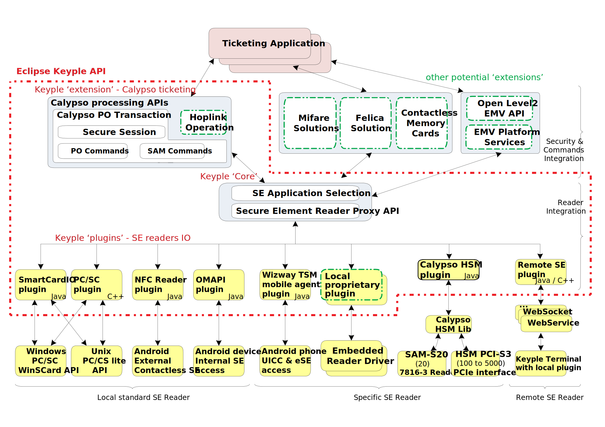
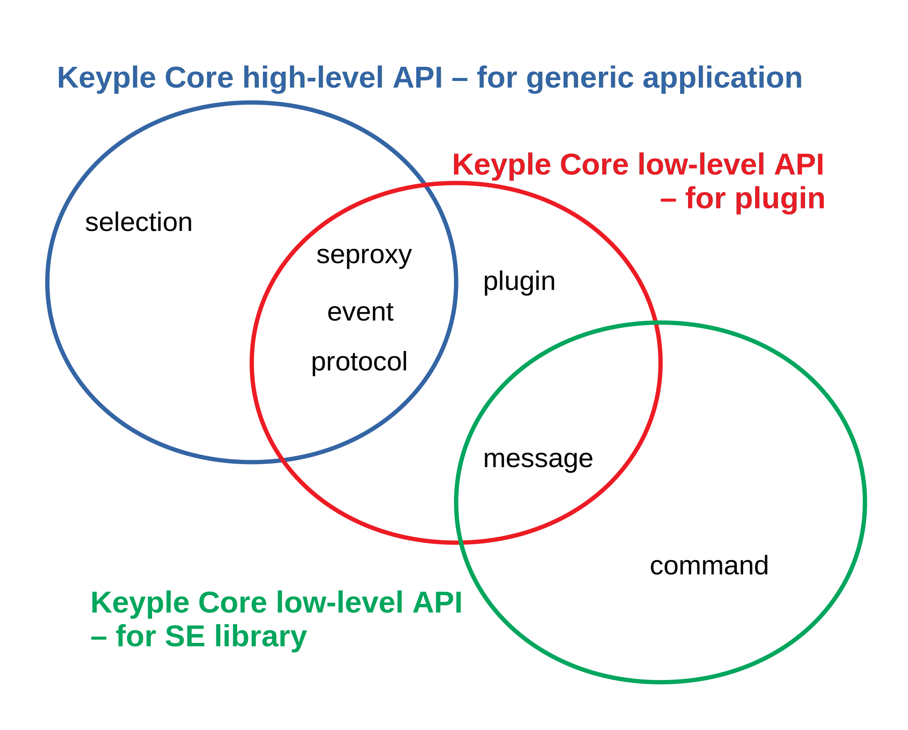
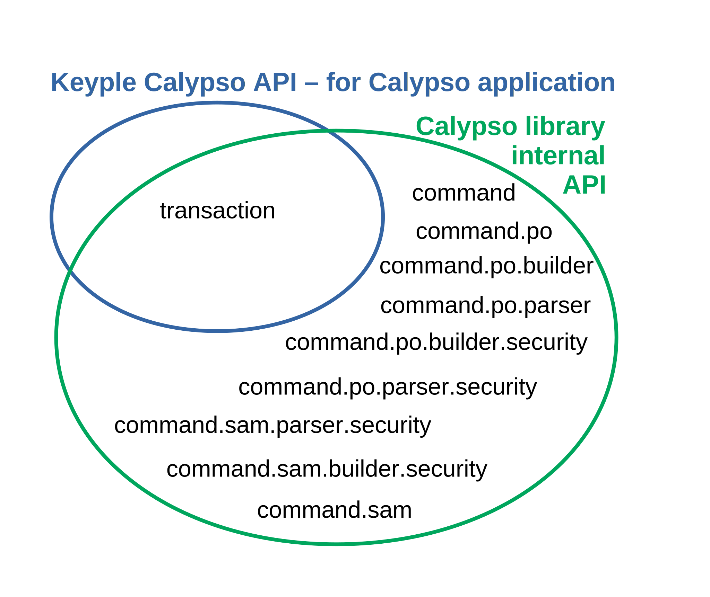

# 'Eclipse Keyple' Java implementation

This is the repository for the Java implementation of the 'Eclipse Keyple' API. Information & guides are available on [keyple.org](https://keyple.org/).

(The C++ implementation is hosted on https://github.com/eclipse/keyple-cpp.)

 - [Global Architecture of Keyple](#global-architecture-of-keyple)
   - [Supported platforms](#supported-platforms)
   - [keyple-java repositories structure](#keyple-java-repositories-structure)
   - [Keyple Core - features / packages and corresponding usages](#keyple-core---features--packages-and-corresponding-usages)
   - [Keyple Calypso - features / packages and corresponding usages](#keyple-calypso---features--packages-and-corresponding-usages)
 - [Getting started](#getting-started)
   - [Cloning this project](#cloning-this-project)
   - [Import keyple components with Gradle](#import-keyple-components-in-your-project)
 - [Artifacts](#artifacts)
 - [Building the Keyple components](#building-the-keyple-components)
   - [Java components](#java-components)
   - [Android components](#android-components)
 - [CI and Docker](#ci-and-docker)

---
## Global Architecture of Keyple



The API is currently divided in two major layers:
- The ‘Keyple Core' : a smart card API which allows managing smart card readers in a generic way, whaterver the reader driver or environment, and for standalone or distributed solution.
- A ‘Calypso Keyple extension' : a high level Calypso Processing API allowing to operate commands with a Calypso Portable Object, and to manage a secure Calypso transaction.

Dedicated reader’s plugins have to be implemented in order to interface the Plugin API with the specific reader’s drivers.

API guides for the Keyple Core and Keyple Calypso are available on the [official documentation page](https://keyple.org/docs).

For a distributed architecture, the Remote Plugin should be used : [Keyple Remote Plugin](/java/component/keyple-plugin/remote).

### Supported platforms
- Java SE 1.6 compact2
- Android 4.4 KitKat API level 19

### keyple-java repositories structure

- Modules that are provided as artifacts
  - keyple-core: source and unit tests for the smart card module (artifact : keyple-java-core)
  - keyple-calypso: source and unit tests for the Calypso library (artifact : keyple-java-calypso)
  - keyple-plugin: source and unit tests for the different plugins: smartcard.io PC/SC, Stub, Android NFC, Android OMAPI, etc.
- developer support, testing
  - [example](/java/example): source for Keyple implementation examples, generic or Calypso specific.

### Keyple Core - features / packages and corresponding usages

The Keyple Core is the basic component of Keyple to handle smart card reader and to operate generic processing with Secure Elements. On Keyple, secure element readers are interfaced through specific reader plugins.

The Core is divided in 3 sub-modules:
- Reader: includes the API to access and manage a reader.
- Plugin: provides factorized processing for the implementation of plugin.
- Card: the generic operation for smart cards.
- Service: the main service of Keyple : SmartCardService

According to the developer’s objective different API must be imported:
- for the implementation of a smart card terminal application, only the high-level API of the ‘reader’ and ‘card’ modules.
- to implement a plugin, all the ‘reader’ API and the low-level ‘plugin’ API.
- to develop a dedicated library supporting the command sets and transaction features of a specific smart card solution, the low-level ‘reader’ and ‘card’ API.

<table>
<thead>
  <tr>
    <th>Module</th>
    <th>Package</th>
    <th>API<br/>level</th>
    <th>Feature</th>
  </tr>
</thead>
<tbody>
  <tr>
    <td rowspan="4">Reader</td>
    <td>org.eclipse.keyple.core.<b>service</b></td>
    <td>high</td>
    <td>Management of the smart card readers<br/>
      <ul><li>Registration of plugins to the smart card Service<br/></li>
        <li>Access to the readers through plugins</li></ul></td>
  </tr>
  <tr>
    <td>org.eclipse.keyple.core.service.<b>event</b></td>
    <td>high</td>
    <td>Notifications of reader plug/unplug, of smart card insertion/removed<br/>
      <ul><li>Define observers of plugins or readers<br/></li>
        <li>Interface to be implemented by observers to be notified on plugin event or reader event<br/></li>
        <li>For observable reader, setting of default selections, to automatically operate in case of smart card insertion</li></ul></td>
  </tr>
  <tr>
    <td>org.eclipse.keyple.core.service.util</td>
    <td>high</td>
    <td>Communication protocols setting for contactless/contacts Reader</td>
  </tr>
  <tr>
    <td>org.eclipse.keyple.card.<b>message</b></td>
    <td>low</td>
    <td>Transmission of grouped APDU commands to a Reader</td>
  </tr>
  <tr>
    <td>Plugin</td>
    <td>org.eclipse.keyple.core.<b>plugin</b><br/>
    <td>low</td>
    <td>Reader plugins implementation<br/>
      <ul><li>Utility classes providing generic processing for Readers </li></ul></td>
  </tr>
  <tr>
    <td rowspan="2">smart card</td>
    <td>org.eclipse.keyple.card.<b>selection</b></td>
    <td>high</td>
    <td>Generic selection of a smart card<br/>
      <ul><li>preparation of smart card selection requests<br></li>
        <li>matching selection results as smart card images</li></ul></td>
  </tr>
  <tr>
    <td>org.eclipse.keyple.core.card.<b>command</b></td>
    <td>low</td>
    <td>Generic API to develop a smart card specific library</td>
  </tr>
</tbody>
</table>

A terminal application operating smart card must only import the Keyple Core packages: ‘service’ and ‘card’.

 //TODO regenerate diagrams

A reader plugin could be implemented by importing the ‘plugin’, ‘card’ and ‘service’ packages.

A smart card specific library could be implemented on top of the ‘card’ package.

### Keyple Calypso - features / packages and corresponding usages

The Calypso transaction API provides a high-level of abstraction to define functional commands to manage a secure session with a Calypso Portable Object, to update or authenticate its data.

The transaction API is defined on a low-level Calypso commands API which contains the builders of PO and SAM APDU commands, and the corresponding parsers of APDU responses.

<table>
<thead>
  <tr>
    <th>Package</th>
    <th>API<br/>level</th>
    <th>Feature</th>
  </tr>
</thead>
<tbody>
  <tr>
    <td>org.eclipse.keyple.calypso.<b>transaction</b></td>
    <td>high</td>
    <td>Calypso Portable Object commands and secure transaction management<br/>
      <ul><li>CalypsoAPI, commands’ settings are limited to functional parameters<br/></li>
        <li>Calypso SAM (Secure Module) operations automatically processed<br/></li></ul>
      (only functional parameters)</td>
  </tr>
  <tr>
    <td>org.eclipse.keyple.calypso.<b>command</b><br/>
      org.eclipse.keyple.calypso.<b>command</b>.po<br/>
      org.eclipse.keyple.calypso.<b>command</b>.po.builder<br/>
      org.eclipse.keyple.calypso.<b>command</b>.po.parser<br/>
      org.eclipse.keyple.calypso.<b>command</b>.po.parser.session<br/>
      org.eclipse.keyple.calypso.<b>command</b>.sam<br/>
      org.eclipse.keyple.calypso.<b>command</b>.sam.builder<br/>
      org.eclipse.keyple.calypso.<b>command</b>.sam.parser<br/>
      org.eclipse.keyple.calypso.<b>command</b>.sam.parser.session</td>
    <td>low</td>
    <td>Calypso PO &amp; SAM APDU commands' sets<br/>
      <ul><li>APDU command builders<br/></li>
        <li>APDU response parsers<br/></li></ul>
      (technical parameter settings specific to the PO &amp; SAM revisions)<br></td>
  </tr>
</tbody>
</table>

Ticketing terminal applications must import only the high-level Calypso transaction package.

 

The only exception is the implementation a Calypso PO/SAM test tool, the setting of low-level APDU commands with wrong settings could require the usage of the Calypso command packages.

---

## Getting started
Releases and snapshots are available from Maven central repositories.

### Cloning this project
This repository includes Java, Android examples of Eclipse Keyple use cases : [Keyple Examples](/java/example)

### Import keyple components in your project

With Gradle, add the following statements to your build.gradle file :

```
repositories {
        //to import releases
        maven { url 'https://oss.sonatype.org/content/repositories/releases' }
        
        //to import snapshots
        maven {url 'https://oss.sonatype.org/content/repositories/snapshots' }
}

dependencies {
    // Keyple Core is a mandatory library for using Keyple, in this case import the last version of keyple-java-core
    // https://mvnrepository.com/artifact/org.eclipse.keyple/keyple-java-core
    implementation group: 'org.eclipse.keyple', name: 'keyple-java-core', version: '1.0.0'
    
    // Import Calypso library to support Calypso Portable Object, in this case import the last version of keyple-java-calypso
    // https://mvnrepository.com/artifact/org.eclipse.keyple/keyple-java-calypso
    implementation group: 'org.eclipse.keyple', name: 'keyple-java-calypso', version: '1.0.0'
    
    // Import PCSC library to use a Pcsc reader, in this case import the last version of keyple-java-plugin-pcsc
    // https://mvnrepository.com/artifact/org.eclipse.keyple/keyple-java-plugin-pcsc    
    implementation group: 'org.eclipse.keyple', name: 'keyple-java-plugin-pcsc', version: '1.0.0'
}
```

With Maven, add the following statements to your pom.xml file :

````maven
<dependencies>
    <!-- Keyple Core is a mandatory library for using Keyple, in this case import the last version of keyple-java-plugin-pcsc -->
    <!-- https://mvnrepository.com/artifact/org.eclipse.keyple/keyple-java-core -->
    <dependency>
        <groupId>org.eclipse.keyple</groupId>
        <artifactId>keyple-java-core</artifactId>
        <version>1.0.0</version>
    </dependency>
    
    <!-- Import Calypso library to support Calypso Portable Object, in this case import the last version of keyple-java-plugin-pcsc -->
    <!-- https://mvnrepository.com/artifact/org.eclipse.keyple/keyple-java-calypso -->
    <dependency>
        <groupId>org.eclipse.keyple</groupId>
        <artifactId>keyple-java-calypso</artifactId>
        <version>1.0.0</version>
    </dependency>
    
    <!-- Import PCSC library to use a Pcsc reader, in this case import the last version of keyple-java-plugin-pcsc -->
    <!-- https://mvnrepository.com/artifact/org.eclipse.keyple/keyple-java-plugin-pcsc -->
    <dependency>
        <groupId>org.eclipse.keyple</groupId>
        <artifactId>keyple-java-plugin-pcsc</artifactId>
        <version>1.0.0</version>
    </dependency>
    ...
</dependencies>
````

## Artifacts
The Eclipse Keyple Java artifacts are published on the Eclipse Keyple Project page [https://projects.eclipse.org/projects/iot.keyple/downloads] (available also on Maven).

- Keyple modules:
  - **'Keyple Core module' JAR**:  the generic API to manage Readers and to select smart card application.
  - **'Keyple Calypso Library JAR'**: the Calypso API to operate a transaction with a Calypso Portable Object.
- Keyple plugins:
  - **'Keyple PC/SC plugin JAR'**: to manage PC/SC readers on a PC environment supporting the # javax.smartcardio API
  - **'Keyple NFC Android plugin AAR'**: to operate the contactless reader of an Android Environment supporting the android.nfc API 
  - **'Keyple OMAPI Android plugin AAR'**: to operate the internal contacts readers of an Android Environment supporting the OMAPI 
  - **'Keyple "stub" plugin JAR'**: plugin to simulate the presence of fake readers with or without fake cards
  - **'Keyple "Remote" plugin JARs'**: plugin & service to manage a smart card remotely in a transparent way.

## Building the Keyple components

This guide helps developer that want to contribute to Keyple components base code. You can fork the project and contribute to it. Every contribution will be reviewed by the developper team and scan by our CI and quality code tools before being merged to the base code.

### Java components

#### Prerequisites
Here are the prerequisites to build the keyple components (jars)
- Java JDK 1.6, 1.7 or 1.8 (Java 11 is not supported yet)
- Maven (any version) [available here](https://maven.apache.org/install.html)
- Gradle (any version as we use the gradle wrapper) [available here](https://gradle.org/install/)

#### Windows, Linux or Macos
Following commands will build all the artifacts at once and install them into the local maven repository.  

On Windows : 
```
./gradlew :installAll --info
```
On Linux, macOS : 
```
.\gradlew.bat :installAll --info
```

### Android components
If you want to build the keyple android components (aar plugins), you need : 
- Java JDK 1.6, 1.7 or 1.8 (Java 11 is not supported yet)
- Intellij 2018+ community version or Android Studio 3.0
- Android sdk 26 should be installed on your machine [follow those instructions](http://www.androiddocs.com/sdk/installing/index.html)
- Gradle (any version as we use the gradle wrapper) [available here](https://gradle.org/install/)

To setup where is installed you Android SDK, you need to create a file `local.properties` in the ```/android```, ``/android/example/calypso/nfc``, ```/android/example/calypso/omapi``` folders with the following content 
`sdk.dir=absolut/path/to/where/your/android/sdk/is`

For instance ``sdk.dir=/Users/user/Library/Android/sdk``

#### Windows, Linux or macOS

First, you need to build and install locally the java component keyple-core (see above)
To build the plugins, execute the following commands :  

On Windows : 
```
cd android
.\gradlew.bat installPlugin
```
On Linux, macOS : 
```
cd android
./gradlew installPlugin
```

To build the example app NFC and OMAPI, first, you need to build and install locally the java component keyple-core, keyple-calypso and keyple-android-plugin (see above)

On Windows : 
```
.\gradlew.bat -b ./example/generic/android/nfc/build.gradle assembleDebug 
.\gradlew.bat -b ./example/generic/android/omapi/build.gradle assembleDebug
```
On Linux, macOS : 
```
./gradlew -b ./example/generic/android/nfc/build.gradle assembleDebug 
./gradlew -b ./example/generic/android/omapi/build.gradle assembleDebug
```


### CI and Docker 
Eclipse CI tools to build and test the components are Open Source too. They can be found in this repository : [Eclipse Keyple Ops](https://www.github.com/eclipse/keyple-ops)
