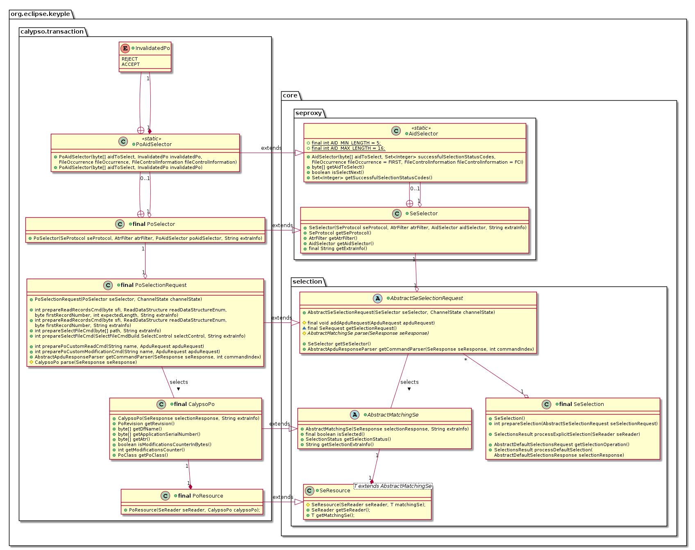
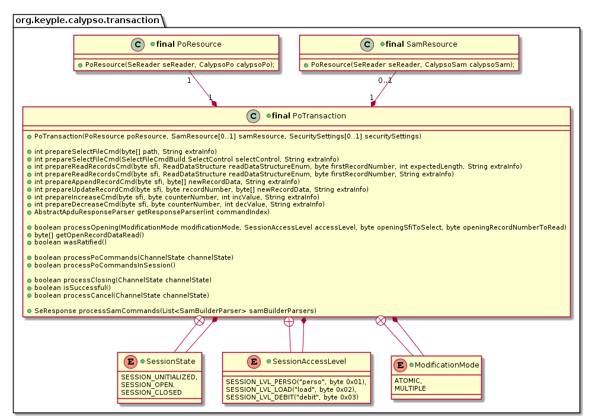

# Keyple ‘Calypso’ – User guide (high level API)
>**Terminal application Calypso API for: 'Calypso Portable Object' selection and transaction**

[1  Packages & features](#packages--features) 
[2  Calypso Selection](#calypso-selection) 
[3  Calypso secure transaction](#calypso-secure-transaction) 

## Packages & features

The **Keyple Calypso User API is an extension of the Keyple Core User API** to manage Calypso Portable Object securely using Calypso SAM:

 - The generic Secure Element selection is enhanced for the **selection of a Calypso PO**. The FCI response is automatically analyzed in order to identify the revision and the features supported by the Calypso PO. The invalidation status is also checked.
 - The selected Calypso PO object allows to automatically initialize a **Calypso PO transaction**: high level functional commands could be prepared and processed in order to **read or write data in the PO file structure**, outside or securely inside a **Calypso secure session**.

<table>
  <tr>
    <td colspan="2"><b>Features</b></td>
    <td><b>Packages</b></td>
  </tr>
  <tr>
    <td rowspan="2" width="15%">Calypso PO operations</td>
    <td width="50%">Selection of Calypso SE: PO or SAM
PO transaction:
 <li>Read / update of data</li>
 <li>PO authentication</li></td>
    <td width="35%">org.eclipse.keyple.calypso.<b>transaction<b></td>
  </tr>
  <tr>
    <td>Calypso PO responses data parsing</td>
    <td>org.eclipse.keyple.calypso.<b>command.po.parser<b></td>
  </tr>  
</table>

## Calypso Selection

The Calypso API to select a Portable object is an extension of the generic Secure Element selection Core API:

 - A PO AID selection could be defined to **accept or reject invalidated PO**.
 - A request for a SE selection is defined with SE selector containing at least an AID (to operate through a Select Application APDU command) or an ATR filter. A request for a PO selection could be enhanced to operate after the PO selector processing some APDU commands with the PO : **Select File or Read Records commands**.
 - In case of successful Calypso PO, the matching SE is retuned as a Calypso PO. The Calypso API analyzes the startup information of a Calypso PO in order to identify the kind of product, its revision, the optional features supported, the file structure used. Then for coming PO commands, the setting of the technical parameters automatically managed.

The PO command grouped with the PO selection have to be “prepared” before the processing of a default or explicit SE selection.

> cf. [“Calypso Use Case 1 / Explicit AID Selection”](https://github.com/eclipse/keyple-java/blob/develop/java/example/calypso/pc/UseCase1_ExplicitSelectionAid/src/main/java/org/eclipse/keyple/example/calypso/pc/usecase1/ExplicitSelectionAid_Pcsc.java) example 
> cf. [“Calypso Use Case 2 / Default Selection Notification”](https://github.com/eclipse/keyple-java/blob/develop/java/example/calypso/pc/UseCase2_DefaultSelectionNotification/src/main/java/org/eclipse/keyple/example/calypso/pc/usecase2/DefaultSelectionNotification_Pcsc.java) example

A ‘PO resource’ is the set of a Calypso PO and the reader on which it is selected.

In a same way the Calypso APO provides the tool to select a Calypso security module (a SAM). A SAM selector doesn’t support AID. The corresponding matching SE is a Calypso SAM. A Calypso SAM and the reader used for its selection defines a ‘SAM resource’.

## Calypso secure transaction

A PO transaction could be operated on a Calypso resource. In case a SAM resource is set, a PO transaction could support the Calypso secure session in order to manage a mutual authentication between the terminal and the Calypso PO.

Through the PO transaction API, only the APDU commands for the PO are explicitly defined; the APDU commands for the SAM are automatically built by the library. Two kinds of methods are provided by the API: ‘**prepare**’ methods, and ‘**process**’ methods.

 - The ‘prepare’ methods allows to define PO file selection and PO data access operations (read or update of records for a specific file, append of record for a cyclic file, increase or decrease of the value of a counter).
 - A ‘process” method sends to the PO at least the previously prepared command.
   - The process PO commands method could operated only if no secure session is currently open with the PO. If one or several PO commands have been prepared, a single request is done to the PO reader.
   - The process opening method allows to manage the opening of a secure session.
     - First a single request is operated to the SAM reader in order to set the PO serial as the cryptographic diversifier, and to get the terminal challenge for the session.
     - Then another single request is done to the PO reader to play the prepared PO command, and to manage the opening of the PO session.
   - A process PO command in session method could be processed only if a secure session is already open with PO.
     - A single request Is operated with the PO reader to operate the prepared PO commands.
     - Another single request is sent to the SAM reader to update the update the digest of the MAC session.
   - The process closing method is used to manage the closing of the secure session with the PO.
     - A first SAM request is operated to update the digest of the last prepared PO commands and to get the terminal session certificate (to save a PO request, the API anticipates the responses of the prepared PO commands).
     - A single PO request is transmitted to run the last prepared PO command, to recover the PO session certificate, and to send the ratification signal if necessary.
     - Finally, a second SAM request allows to authenticate the PO. If the transaction is successful the mutual authentication is valid, and the PO has atomically committed the requested data updates.

The minimal costs of a Calypso secure session are:

 - 3 PO requests (1 for the PO selection + 1 for the PO session opening + 1 for the PO session closing).
 - And 3 SAM requests if the SAM is already selected (1 for the PO session opening + 2 for the PO session closing); otherwise 4 SAM requests if the SAM isn’t already selected.

By default, the PO transaction manages the Calypso secure session as ‘atomic’: the cumulative amount of PO updates command can’t exceed the size of the PO session buffer.
> cf. [“Calypso Use Case 4 / PO Authentication”](https://github.com/eclipse/keyple-java/blob/develop/java/example/calypso/pc/UseCase4_PoAuthentication/src/main/java/org/eclipse/keyple/example/calypso/pc/usecase4/PoAuthentication_Pcsc.java) example

The PO transaction could also be defined to allow multiple sessions: in this case the transaction is automatically split in several session as necessary.
> cf. [“Calypso Use Case 5 / PO Multiple Session"](https://github.com/eclipse/keyple-java/blob/develop/java/example/calypso/pc/UseCase5_MultipleSession/src/main/java/org/eclipse/keyple/example/calypso/pc/usecase5/MultipleSession_Pcsc.java) example
