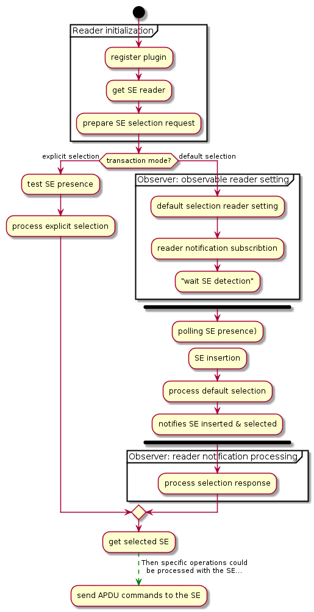
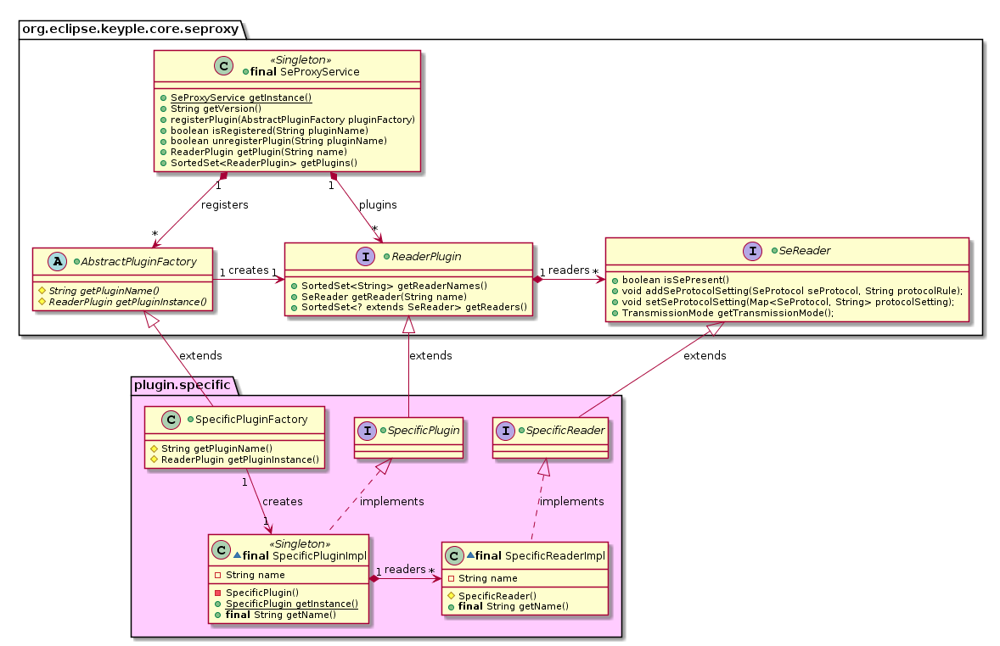
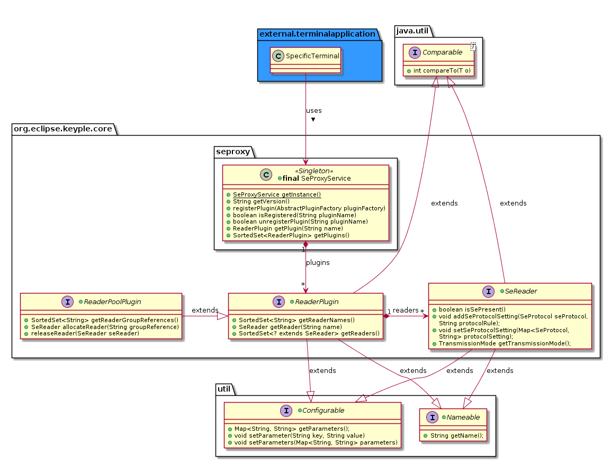
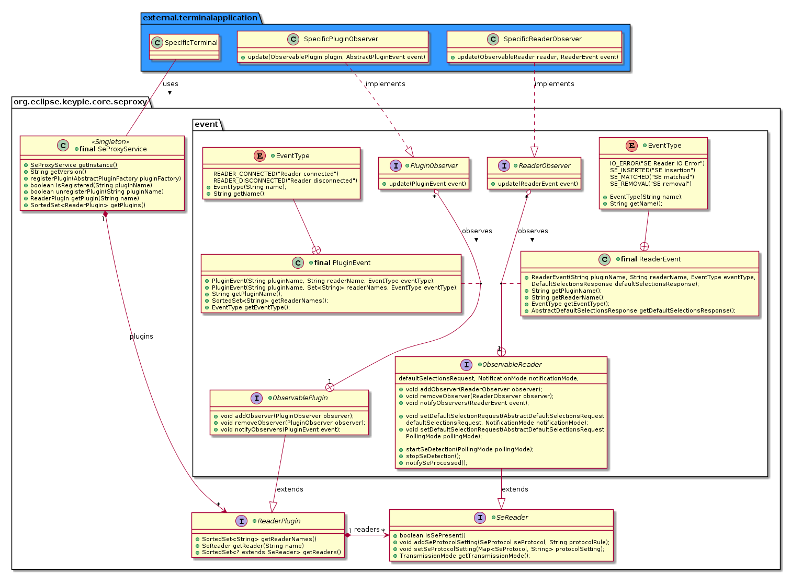
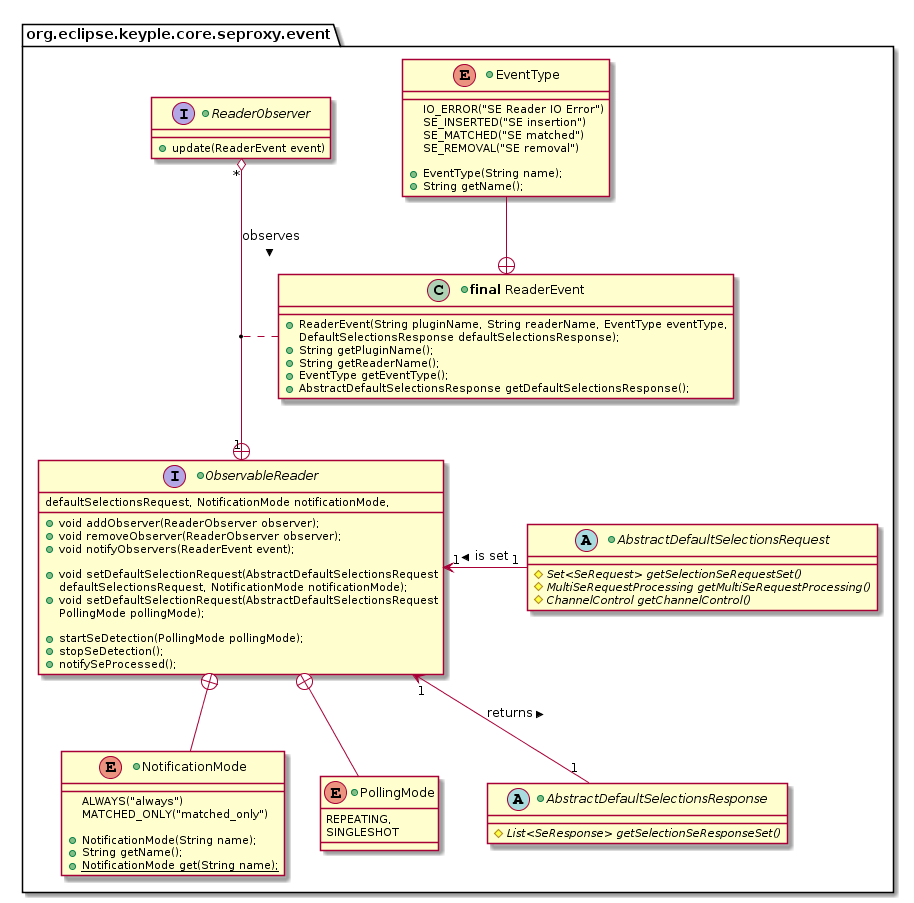
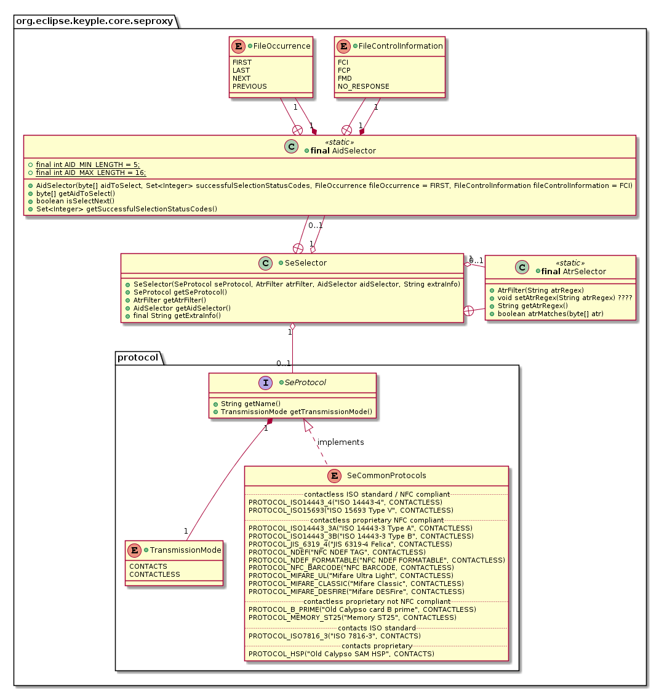
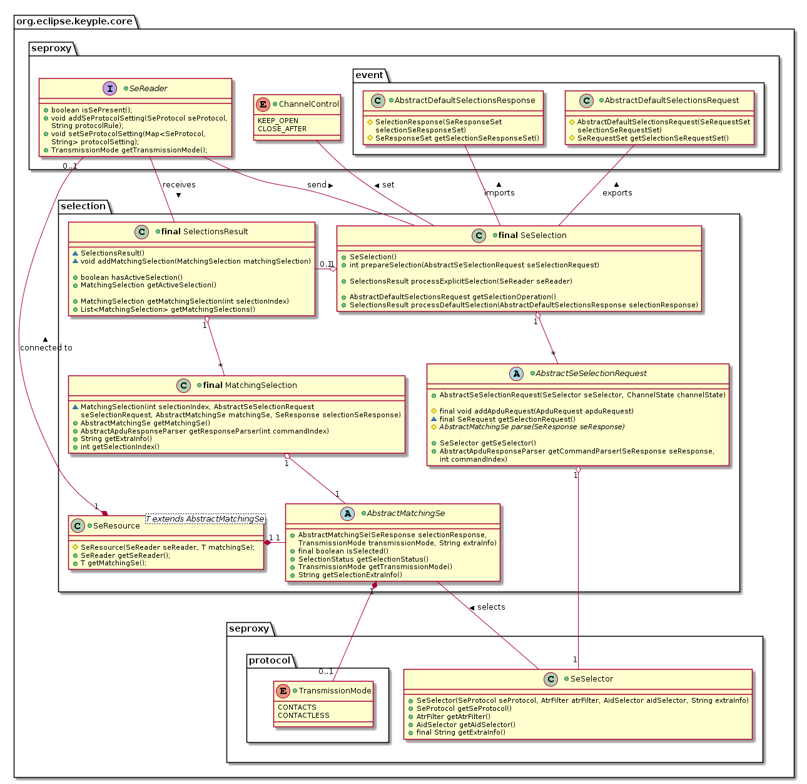

# Keyple ‘Core’ – User guide (high level API)
>**Terminal application generic API for: reader access, and generic 'Secure Element' selection**

This high-level API is convenient for developers implementing smart card processing application for terminal interfaced with smart card readers.

[1	Packages & features](#packages--features) 
[2	Secure Element transaction sequence – setting & selection](#secure-element-transaction-sequence--setting--selection) 
[3	Secure Element Proxy Service API – readers management](#secure-element-proxy-service-api--readers-management) 
[3.1	Plugin setting](#plugin-setting) 
[3.2	SE readers’ access](#se-readers-access) 
[3.2.1	Support of reader farm or HSM](#support-of-reader-farm-or-HSM) 
[3.2.2	SE presence check & “explicit selection transaction”](#se-presence-check--explicit-selection-transaction) 
[3.3	Plugin & Reader events](#plugin--reader-events) 
[3.3.1	Plugin observability activation](#plugin-observability-activation) 

[3.3.2	Automatic selection & “default selection transaction”](#automatic-selection--default-selection-transaction) 
[3.3.3	Reader notification modes](#reader-notification-modes) 
[3.3.4	Reader observability activation, “polling mode” & “SE removal procedure”](#reader-observability-activation-polling-mode--se-removal-procedure) 
[4	Secure Element Selection API](#secure-element-selection-api) 
[4.1	Selection parameters (Communication protocol, ATR, AID)](#selection-parameters-communication-protocol-atr-aid) 
[4.2	Selection transaction](#selection-transaction) 

## Packages & features
The Keyple Core User API is a tool to manage readers, and to select “generic” Secure Elements.

<table>
  <tr>
    <td colspan="2"><b>Features</b></td>
    <td><b>Packages</b></td>
  </tr>
  <tr>
    <td rowspan="3">SE reader management</td>
    <td>Secure Element reader access</td>
    <td>org.eclipse.keyple.core.<b>seproxy<b></td>
  </tr>
  <tr>
    <td>Notifications of:
           <li>reader plug/unplug,</li>
           <li>SE insertion/remove</li>
           Definition of automatic selection request in case of SE insertion on an Observable Reader.</td>
    <td>org.eclipse.keyple.core.seproxy.<b>event<b></td>
  </tr>
  <tr>
    <td>Communication protocols filters (setting for contactless/contacts SE Reader)</td>
    <td>org.eclipse.keyple.core.seproxy.<b>protocol<b></td>
  </tr>
  <tr>
    <td>SE selection</td>
    <td>Generic selection of a Secure Element</td>
    <td>org.eclipse.keyple.core.<b>selection<b></td>
  </tr>
</table>

## Secure Element transaction sequence – setting & selection
A Secure Element transaction starts with the setting of plugins in order to choose the reader to communicate with SE.

Using a SE reader, depending on its capabilities, there can be two ways to select a SE through it:
 - Either the processing of an “explicit selection”: if a SE is present in the reader, then the terminal directly operates a SE selection request through the reader.
 - Otherwise if the reader is “observable”, the operating of a “default selection”: in this case a default selection request is defined on the reader, the terminal observes the reader, and wait to be notified by the reader about a SE insertion and selection.

At the end the terminal gets a selected SE, it can follow by operating APDU commands with the selected SE until the communication channel is kept open.

Then a Keyple Core extension could be used to operates APDU commands with the selected SE solution.
> The Keyple Calypso extension provides a high-level API to defined ticketing processing involving Calypso cards, cf.: [“Keyple Calypso User Guide”](https://github.com/eclipse/keyple-java/blob/master/docs/KeypleCalypso_UserGuide.adoc).

## Secure Element Proxy Service API – readers management
Using the Keyple Core, Secure Element Readers (SeReader) are managed through plugins (ReaderPlugin).

The active plugins are registered to the SE Proxy Service (the singleton SeProxyService).
 - Each plugin is registered through a unique name to the SE Proxy Service.
 - Each reader of a plugin is also defined with a unique name inside the plugin.

### Plugin setting
To secure the usage of the SE Proxy API for the development of terminal applications, the internal implementation of plugins (classes SpecificPluginImpl & SpecificReaderImpl) is hidden.

 - For a specific plugin, only the plugin & reader interfaces (SpecificPlugin & SpecificReader) and the factory (class SpecificPluginFactory) are public.
 - The factory of a plugin is set to register a specific plugin to the SE Proxy Service.

Most of plugins of local readers of Keyple are defined as singleton with a unique instance (e.g.: PC/SC, Android NFC, Android OMAPI, most of embedded readers).

For the Remote SE plugin defined to manage remote readers, specific plugin instances are created for each communication interfaces.

### SE readers’ access
The SE Proxy Service allows to get all the list of the active plugins. A specific plugin could also be directly recovered through its name.

In the same way, a plugin can provide the list of all the plugged readers.

Depending on the native reader technology, some specific parameters could be defined at the plugin or reader level.

For a classic plugin, the number of readers is determinate, all the plugged readers of the plugin are directly available for the SE Proxy Service.

#### Support of reader farm or HSM
For systems based on a centralized security, in order to manage multiple remote terminal in parallel, central servers could requires to interface a huge number (several hundreds or thousands) of SE through a farm of readers or HSM (Hardware Security Module: an electronic board able to emulate multiple SE).

 - The multitude of embedded SE could be divided in different groups of profiles.
 - An HSM is often shared between several services, so the full set of readers isn't directly available for a service, a service has to request the allocation of a reader from a specific group.

The SE Proxy Service could support reader farm or HSM though plugins managing "pool" of readers (ReaderPoolPlugin).

 - At the initialization, the list of reader is empty. The list is be filled depending on the reader allocations requested.
 - When not more required, a reader could be released from the pool.

All plugins have to implement the interface ReaderPlugin and SeReader. A plugin managing a pool of reader should implement in addition the interface ReaderPoolPlugin.

#### SE presence check & “explicit selection transaction”
A SE reader has the capability to check is a SE is present or not.

> For SE terminal processing for which the presence of a SE in a reader is "static' during a transaction, the transaction starts in general with the verification of the SE presence. If the SE is present, the transaction can continue with the selection of the SE. We call this kind of transaction: an "explicit selection transaction".

### Plugin & Reader events
For some SE terminal, the processing is dynamically driven by the insertion/remove of a SE in a reader, or by the plug/unplug of a reader.

E.g., in transportation, the ticketing transaction of access control gates is often started when a contactless card is detected in the field of the reader. For that, in Keyple, a SE reader or a plugin has to be observable.

A plugin could be optionally observable (by implementing ObservablePlugin).

 - In this case a terminal application could observe the plugin (by implementing PluginObserver) in order to be notified (PluginEvent) when a new reader is plugged to the plugin, or when a referenced reader is unplugged.
 - To receive the notification of a specific plugin, the plugin observer should first be added to the observer list of the observable plugin.

Depending on the capability of the plugin, a reader could be optionally observable (by implementing ObservableReader).

 - A terminal application could observe the plugin (by implementing ReaderObserver) in order to be notified (ReaderEvent) when a SE is inserted or removed from a specific.
 - The reader observer should be added to the observer list to receive the notifications the observable reader.

By default, an observable reader notifies only the insertion or the remove of a SE.

#### Plugin observability activation
An observable plugin automatically starts to observe plugin events when at least one plugin observer is registered and stops the listening when the last plugin observer is removed.

#### Automatic selection & “default selection transaction”
On an observable reader, there is in addition the possibility to define a "default selection operation": in this case, when a SE is inserted, the observable reader tries automatically to select the inserted SE using the defined default setting.

 - If the inserted SE is successfully selected, then the observable reader notifies that "an inserted SE has matched the default selection" and provides the corresponding response.
 - Otherwise if the observable reader failed to select the inserted SE, it could just notify that a SE has been inserted.

> For SE terminal for which the processing is "dynamically" driven by the presence of a SE in a reader, the transaction starts in general with the detection of the insertion of a SE and its automatic selection. The reader observer is then notified to analyze the response of the selected SE, and to continue the transaction with the SE. We call this kind of transaction: a "default selection transaction".

#### Reader notification modes
If no default selection is defined, an observable reader notifies its observers for “SE insertion” (whatever the SE detected) or “SE removed” events.
A default selection could be defined for the “always” or the "matched only” notification mode.

 - In the always mode, if the inserted matches the default selection, the observers are notified about a “SE matched” event, otherwise an “SE insertion” event is notified.
 - In case of "matched only” mode, the observable reader doesn’t notify SE insertion event. The reader observer will be notified only if a default selection succeed on the observable reader; this configuration allows the reader observer to skip the processing of wrong SE insertions.

#### Reader observability activation, “polling mode” & “SE removal procedure”
For an observable reader, the listening of reader event requires also the registration of at least one reader observer.

An observable reader could switch between four internal states: “Wait for start detection”, “Wait for SE insertion”, “Wait for SE processing”, “Wait for SE removal”.

 - At the wait for start detection, the observable reader doesn’t notify any event.
 - The start of the SE detection by an observable reader need to be  explicitly requested by an observer by setting a “polling mode” either through a ‘startSeDetection’ or a ‘setDefaultSelectionRequest’ commands. The SE detection could be started for polling mode defined either in “single shot” or “repeating” mode.
   - In single shot mode, the observable reader stops the detection after the SE removal (back to the wait for start detection).
   - In repeating mode, after the SE removal, the observable reader restart to detect another SE (back to the wait for SE insertion).
 - Wait for SE insertion, if a SE is inserted or selected, the registered reader observers are notified by the observable reader according to the defined notification mode. The observable reader switches to the wait for SE processing.
 - During the SE processing by the observers, the observable reader waits that an observer acknowledges the end of the SE processing.
 - There are two waits to ends the processing of an observed SE:
   - Either an observer directly could stop the listening of the observable reader (‘stopSeDetection’ command). The observable reader switches to the wait for start detection, and the observers are immediately notified about the SE remove.
   - Otherwise, the observers could wait for a clean remove of the SE from the observable reader; it’s the SE removal sequence:
     - When the main reader observer has finished the processing of the SE, it could request the observable reader to wait for the remove of the SE (‘notifySeProcessed’ command).
     - Finally, the reader observers could be notified when the SE is effectively removed.
     - If the SE insertion listening started in the "repeating polling mode", then when the SE is removed, the observable reader automatically starts again the listening of a new SE insertion; otherwise a new explicit request to start the SE listening is required to restart the listening.

## Secure Element Selection API
### Selection parameters (Communication protocol, ATR, AID)
To select a Secure Element, a SE Selector has to be defined, based on one to three parameters.

 - A SE selection could be defined for a specific communication protocol.
 - A SE could be filtered for an ATR (Answer To Reset) matching a specific regular expression.
 - A specific application of a SE could be selected by setting its AID (Application IDentifier). 

### Selection transaction
To operate a transaction with a SE, it should be firstly selected. The aim of the SE selection API is to get a SE resource: a set of a reader with a selected SE.

A SE Selection is managed in two steps:

 - first the “preparations” of selection request based on SE selector,
 - next the “processing” of the selection requests.

In order to manage multiple kinds of SE, several selection requests could be prepared with different selectors.

Depending on the setting of the reader, the processing of the selection could be operated in two different ways:

 - either in a “explicit” way after the checking of the SE presence,
 - or in a ”default” way for an observable reader detecting the insertion of a SE.

> cf. [“Generic Use Case 1 / Explicit AID Selection”](https://github.com/eclipse/keyple-java/blob/develop/java/example/generic/pc/UseCase1_ExplicitSelectionAid/src/main/java/org/eclipse/keyple/example/generic/pc/usecase1/ExplicitSelectionAid_Pcsc.java) example 
> cf. [“Generic Use Case 2 / Default Selection Notification”](https://github.com/eclipse/keyple-java/blob/develop/java/example/generic/pc/UseCase2_DefaultSelectionNotification/src/main/java/org/eclipse/keyple/example/generic/pc/usecase2/DefaultSelectionNotification_Pcsc.java) example

In case a SE Selection is prepared with a channel control mode defined as “keep open”, then the different prepared selectors are operated with the presented SE, but the processing of the selection stops when a selector matches the SE.

 - The result of the SE selection could be a single ‘matching SE’: this SE is kept as selected in the reader. It’s possible to directly operate command with the SE.

But if a SE selection has been defined with a channel control mode at “close after”, in this case all the prepared SE selectors are operated whatever the matching result.

 - After each selector processing, if a selector has matched, the logical channel with the SE is closed (the SE is no more selected).
 - If several applications of the presented SE have matched the selectors: the result of the processing of SE selections is a list matching SE, but all of them are deselected. To continue the SE processing, the terminal application has to choose one matching SE, and to select it again but in “keep open” channel control mode.

> cf. [“Generic Use Case 3 / Grouped Multi-Selection”](https://github.com/eclipse/keyple-java/blob/develop/java/example/generic/pc/UseCase3_GroupedMultiSelection/src/main/java/org/eclipse/keyple/example/generic/pc/usecase3/GroupedMultiSelection_Pcsc.java) example

After the selection of a SE, using a SE resource, the terminal can continue by operating a specific transaction with the corresponding SE.

> cf. [“Generic Use Case 4 / Sequential Multi-Selection”](https://github.com/eclipse/keyple-java/blob/develop/java/example/generic/pc/UseCase4_SequentialMultiSelection/src/main/java/org/eclipse/keyple/example/generic/pc/usecase4/SequentialMultiSelection_Pcsc.java) example
