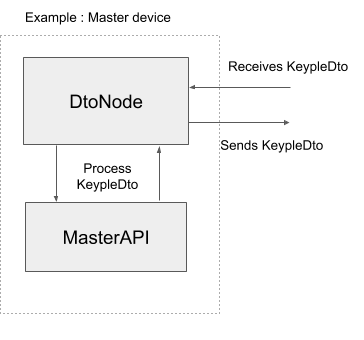
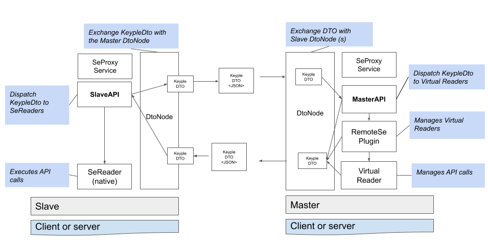

# Keyple Remote SE - User Guide

## Why do I need Remote SE

The Remote SE architecture allows a device to communicate remotely with a **SE Reader** plugged into another device. 

It is mostly used to host the Ticketing Logic on a remote server. The end user terminal allows the server to connect to its local **SE Reader **via the Remote Se API, then the server can communicate with the Reader as if it was a local reader.

In a Calypso context, it is useful when a SAM reader and a PO reader are not connected to the same terminal. With the Remote Se API, you can open Calypso transaction within a distributed architecture.


## How does it work

The architecture is based on a Slave-Master principle. The slave hosts a local SE reader that will be accessed remotely by the Master. 

The components of the Remote Se Architecture don’t rely on a given transport layer, either Slave and Master can be a client or a server of any protocol (ie : http, websocket). 

Example of a use case

A server (let's identify it **server1**) needs to communicate with other terminals reader (**client2**). To give access to it's local reader, **client2** should open a session to **server1** via the `SlaveAPI#connect()` method. Doing this, **server1** receives the possibility to communicate with the local reader of **client2**. In this scenario **server1** is a Master node and **client2** is a Slave node.

When **client2** opens successfully a session to **server1**, a `VirtualReader` is created on **server1** side. This `VirtualReader` is viewed as a local reader **server1**, in fact, the `VirtualReader`  acts as a proxy to the `SeReader` hosted on **client2**.


## KeypleDto

The Remote Se Architecture is based on a RPC architecture. When a Master node invokes a transmit method on a Virtual Reader, this method is called on the corresponding local Reader on the Slave node.

The RPC protocol of the Remote Se Architecture is based on Json messages sent back and forth between the Slaves and the Master.

Those messages share a common structure called **KeypleDto** whose definition is specified here after. 

The definition of the keypleDto follows the Json-RPC 1.0 specification.


```
KeypleDto definition

/* Metadata */
String requesterNodeId; // Requester Node Id 
String targetNodeId; // Receiver Node Id 
String sessionId; // Master reader session
String nativeReaderName; // Native reader name
String virtualReaderName; // Virtual reader name

/* API call */ 
String id; // Id of the request
String action; // API methods to be called (listed in the object RemoteMethodName)
String body; // Arguments of the API (json-serialized)
Boolean isRequest; // Is a request or a response
```


## User guide

To establish a connection with the master, the slave device must use the **SlaveAPI**.

By passing a local reader to the connectReader, the slave will contact the master resulting in the opening of a virtual session.

During this session, a Virtual reader is available on the master side. Every apdu command sent to the Virtual Reader will be transferred to the Local reader and the response sent back to the Virtual reader

**VirtualReader** are created by the **RemoteSePlugin** on Master node when a local reader initiates a connection.


```
Slave API
 - connectReader(SeReader localReader) : connect a local reader to the master node 
 - disconnectReader(String sessionId, String nativeReaderName) : disconnect a connected reader from the master node

Master API
 - RemoteSePlugin getPlugin() : get the remote se plugin


On Master node the main object is the VirtualReader 
- It can be manipulated as any SeReader
- Every command is transferred to the local reader
- It is accessible from the RemoteSe Plugin
```


## Configuration

To allow the slave and master to exchange KeypleDto, a transport layer should be implemented via simple node-to-node layout. Both SlaveAPI and MasterAPI needs a DtoNode to be functional. 

DtoNode can be implemented in top of websocket protocol or http webservice protocol. As Slave and Master have the initiative to send keypleDto, it is preferred to provide a 2-way communication protocol. 

In case of http webservice, a polling mechanism can be implemented so the server can send messages to the client.


<p id="gdcalert1" ><span style="color: red; font-weight: bold">>>>>>  gd2md-html alert: inline image link here (to images/Remote-SE0.png). Store image on your image server and adjust path/filename if necessary. </span><br>(<a href="#">Back to top</a>)(<a href="#gdcalert2">Next alert</a>)<br><span style="color: red; font-weight: bold">>>>>> </span></p>





## Architecture overview


<p id="gdcalert2" ><span style="color: red; font-weight: bold">>>>>>  gd2md-html alert: inline image link here (to images/Remote-SE1.png). Store image on your image server and adjust path/filename if necessary. </span><br>(<a href="#">Back to top</a>)(<a href="#gdcalert3">Next alert</a>)<br><span style="color: red; font-weight: bold">>>>>> </span></p>





## Quickstart Guide


### Configure Master API with a DtoNode

In this quickstart guide, we will use a pre-built transport layer for the Remote Se Architecture. 

This transport layer is built upon a Webservice protocol with polling. It is available on the remotese example projects under the package ‘transport”.

The MasterAPI will be instanciated with the ServerNode of the WsPollingRetrofit Transport.

The ServerNode component of this transport is a self contained web server based on the sun jdk 6.


```
/* Configure the server  Dto Node with a unique nodeId */
ServerNode node = new WsPollingRetrofitFactory("master1").getServer()
/* Start the server */ 
node.start() 
/* Create a MasterAPI bound to this DtoNode */
MasterAPI masterAPI = new MasterAPI(SeProxyService.getInstance(), node);
```


### Configure Slave API with a DtoNode

On the other hand, the slave we will instanciate the SlaveAPI with the clientNode of the transport with the Master node id, it will connect to.


```
/* Configure the client Dto Node layer with the master node it will connect to and a unique slave node id*/
ClientNode node = new WsPollingRetrofitFactory("master1").getClient("client1")
/* Establish connection */
node.connect()
/* Create the SlaveAPI */
SlaveAPI slaveAPI = new SlaveAPI(SeProxyService.getInstance(), node, "master1");
```


### Connect a local Reader to Master

The next step is to connect a SeReader from the slave node by calling the SlaveAPI connectReader method. 

In this example we will use a StubReader instanciated from the Stub Plugin. \
 \
Once the local reader is connected, it can be used by the Master as a Virtual Reader.


```
/* Slave */
StubPlugin stubPlugin = StubPlugin.getInstance();
stubPlugin.plugStubReader("stubClientSlave", true);
/* retrieve SeReader Instance */ 
SeReader localReader = stubPlugin.getReader("stubClientSlave");
/* connect local Reader to Master */ 
slaveAPI.connectReader(localReader)
```


### Listen for Reader Events on Master side

To get notified of a SeReader connection, you can observe the Remote Se Plugin, <RsePlugin> for events such as : **_READER_CONNECTED, READER_DISCONNECTED_**

 

To get notified of a Se inserted into a remote Se Reader, you can observe the corresponding Virtual Reader for events such as : **_SE_MATCHED, SE_INSERTED, SE_REMOVED_**


```
/* Master */

RsePlugin rsePlugin = masterAPI.getPlugin();

rsePlugin.addObserver(this);

public void update(final Object o) {
    // Receive a PluginEvent
    if (o instanceof PluginEvent) {
        switch (o.getEventType()) {
            case READER_CONNECTED: break;
            case READER_DISCONNECTED:break;}
    }
    // ReaderEvent
    else if (o instanceof ReaderEvent) {
        switch (o.getEventType()) {
            case SE_MATCHED:break;
            case SE_INSERTED:break;
            case SE_REMOVED:break;
}
```


## Developer Guide


### KeypleDto type

KeypleDto are RPC messages sent back and forth between Slave nodes and the Master node. They transport a piece of information that can be a Request, a Response, an Error or a Notification. A fifth type is used internally : NoResponse. 


*   **Request** : it transports the remote procedure invocation. It can be a ProxyReader method such as a transmit() or a remoteSe specific method like connectReader. The name of the method is in the “action” field, the “body” wraps the parameters of the method. Each Request is assigned a unique “id” to be easily retrieved.
*   **Response** : it transports the remote procedure response, if it is not an error. It matches a Request and will be sent to the node that originated the Request. The “body” field contains the response object(s).
*   **Error** (Exception) : Same as Response but it transports an error resulting from the Request. The “body” field contains a Java Exception
*   **Notification** : it transports a notification such as a ReaderEvent. No response is expected from a notification. The ‘id’ field is empty
*   **NoResponse** : it should not be sent. This keypleDto is a stop semaphore to notify DtoNode that the received keypleDto do not expect a response back.


### How Reader Events are processed in Remote Se Architecture

When a Reader Event (SE_INSERTED) is thrown by a local reader, if this local reader is connected to a Master, the event is then propagated to the virtual reader on the Master node.

When received by the virtual reader, the event is transformed to be seen by the Master Application as an event thrown by the virtual reader. The fields reader name and plugin name are converted to match the Virtual Reader name and the Remote SE Plugin name.


### Transport implementation


#### TransportDto vs KeypleDto

`KeypleDto` is the object that contains the information about the remote invocation, they are built and processed by the plugin, there is no need to modify them.

Users needs to implement (and personalize if needed) `TransportDto` which is an envelop for a KeypleDto. It allows to enrich a KeypleDto with information on the transport implementation to allow back and forth communication. (for instance a callback url)


#### DtoNode

`DtoNode` is a convenient interface, it links a `DtoSender` with a `DtoHandler` to create a unique point of contact.


#### DtoSender

`DtoSender` is the component responsible for sending the TransportDto to the other terminal.


#### DtoHandler

`DtoHandler` interface is implemented by both `SlaveAPI` (Slave side) and `MasterAPI` (Master side). Both services waits for a KeypleDto, process it, and will return a KeypleDto as a response (if any). You should link a `DtoNode` to both `SlaveAPI` and `MasterAPI` to make them communicate.

