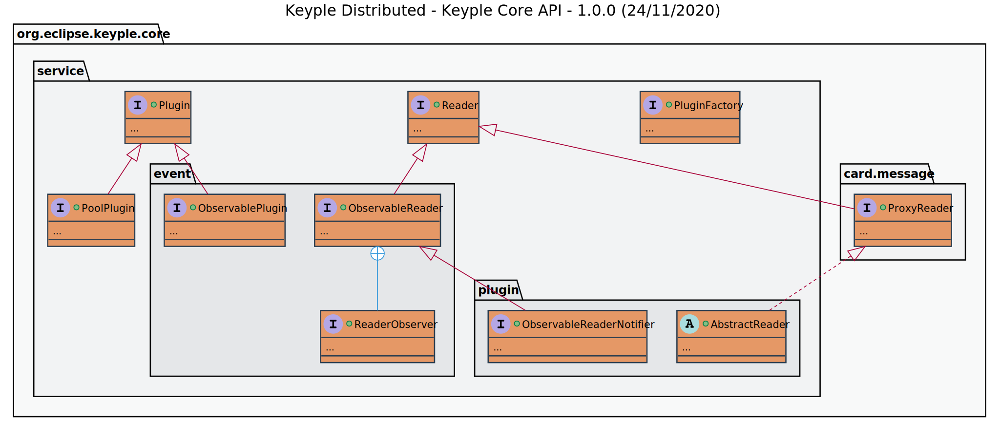
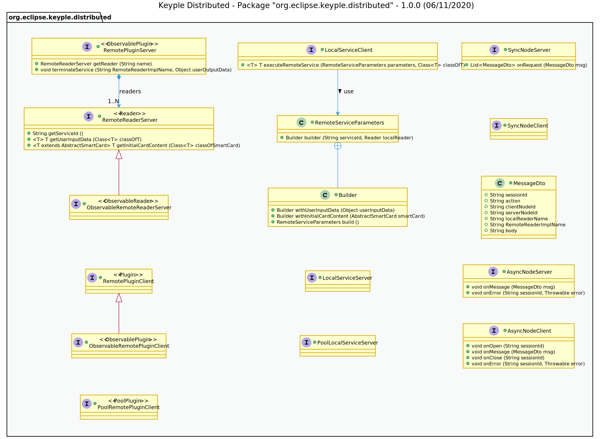
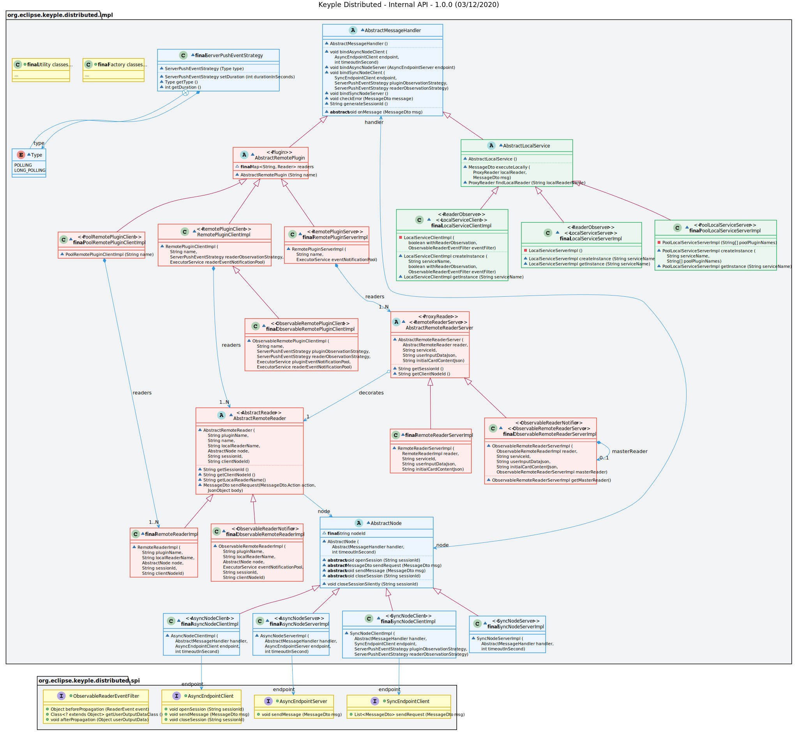

# Keyple Distributed Network

## Overview

The **Keyple Distributed Network** Java library contains the common network elements used by the [Keyple Distributed Local](../local/README.md) and [Keyple Distributed Remote](../remote/README.md) libraries provided by the **Keyple Distributed** solution.

This library **should not be import explicitly because it's imported by transitivity** by the main libraries.

## User Guide & Download Information

The full documentation, including download information is available in the [Developer Guides / Distributed Application](https://keyple.org/docs/developer-guide/distributed-application/) section of the official Keyple website [keyple.org](https://keyple.org)

## Build the Code

The code is built with **Gradle** and is compliant with **Java 1.6** in order to be able to be used by a very large number of applications.

## Code Contributions

We welcome code contributions through merge requests. Please help us enhance the plugin !

In addition to the APIs class diagram available on the official website, here is the internal API :

