# Keyple Remote SE Plugin (Core library)

The **Keyple Remote SE Plugin** allows a terminal to communicate with a "native" SE reader plugged into an another terminal.

In a Calypso context, it is useful when your SAM reader and/or your PO reader are not connected to the same terminal. With the **Keyple Remote SE Plugin**, you can open Calypso transaction within a distributed architecture.

## Table of Contents

* [Overview](#overview)
* [About Core library](#about-core-library)
* [How to use it ?](#how-to-use-it-)
* [Use cases](#use-cases)
    * [Remote SE Server Plugin](#remote-se-server-plugin)
    * [Remote SE Client Plugin](#remote-se-client-plugin)
    * [Remote SE Pool Client Plugin](#remote-se-pool-client-plugin)
* [Public Global API](#public-global-api)
* [Network configuration](#network-configuration)
    * [Full-Duplex Asynchronous communication](#full-duplex-asynchronous-communication)
    * [Client-Server Synchronous communication](#client-server-synchronous-communication)
* [Exchanged data](#exchanged-data)
* [Annexes](#annexes)
    * [Remote SE Server Plugin API (class diagram)](#remote-se-server-plugin-api-class-diagram)
    * [Remote SE Client Plugin API (class diagram)](#remote-se-client-plugin-api-class-diagram)
    * [Remote SE Pool Client Plugin API (class diagram)](#remote-se-pool-client-plugin-api-class-diagram)
    * [Remote SE Server Plugin (sequence diagram)](#remote-se-server-plugin-sequence-diagram)

## Overview

The **Keyple Remote SE Plugin** is divided into two main libraries, and one common library :
* The **[Native SE](../nativese/README.md)** library (`keyple-plugin-remotese-nativese`) : This library must be used by the application installed on the terminal having local access to the SE reader.
* The **[Virtual SE](../virtualse/README.md)** library (`keyple-plugin-remotese-virtualse`) : This library must be used by the application installed on the terminal not having local access to the SE reader and that wishes to control the reader remotely.
* The **Core** library (`keyple-plugin-remotese-core`) : The common library.

## About Core library

The **Core** library contains all the common components used by **Native SE** and **Virtual SE** libraries such as nodes used for communication management.

> Therefore, you do not have to import it explicitly because it's imported by transitivity.

## How to use it ?

1. Read first [Overview](#overview) & [About Core library](#about-core-library) chapters.
2. Find your use case with the help of chapter [Use cases](#use-cases). This will help you determine exactly which interfaces to use.
3. Import [Native SE](../nativese/README.md) and/or [Virtual SE](../virtualse/README.md) libraries depending on your use case.
4. Using chapter [Network configuration](#network-configuration), you must implement the transport layer using the sequence diagram adapted to your network configuration.
5. Implement your ticketing services using the interfaces detailed in chapter [Public API](#public-api).

## Use cases

### Remote SE Server Plugin

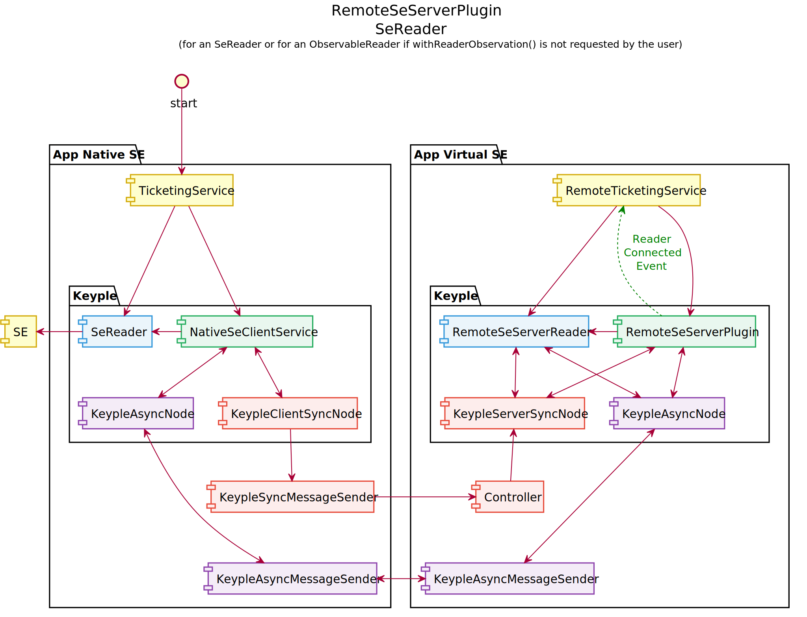

### Remote SE Client Plugin

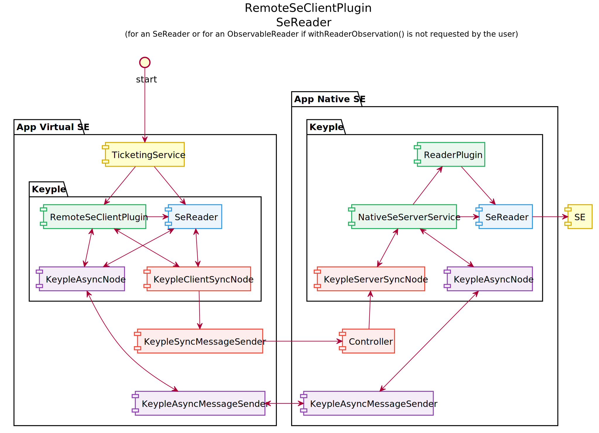

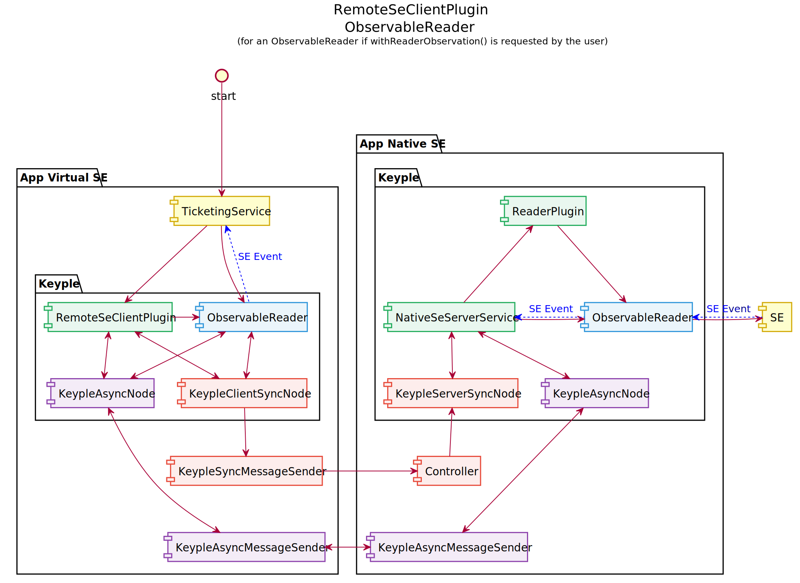

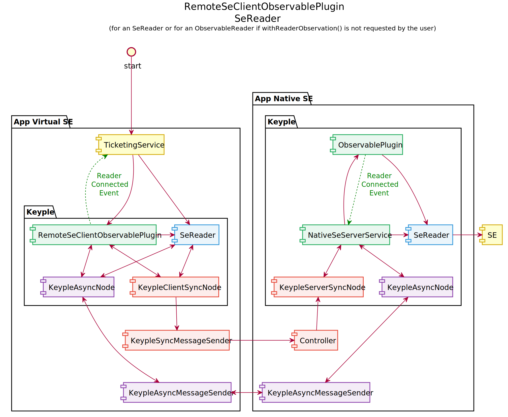

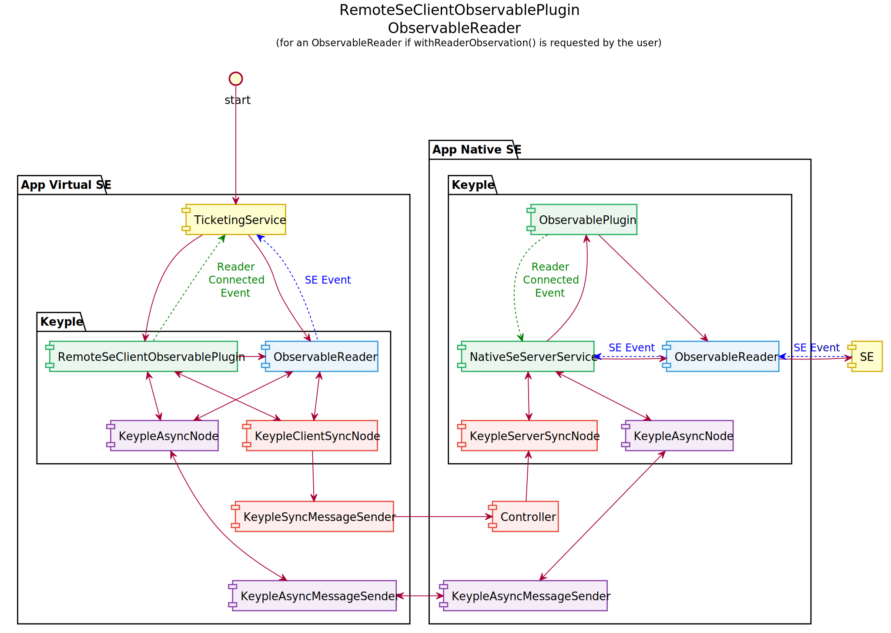

### Remote SE Pool Client Plugin

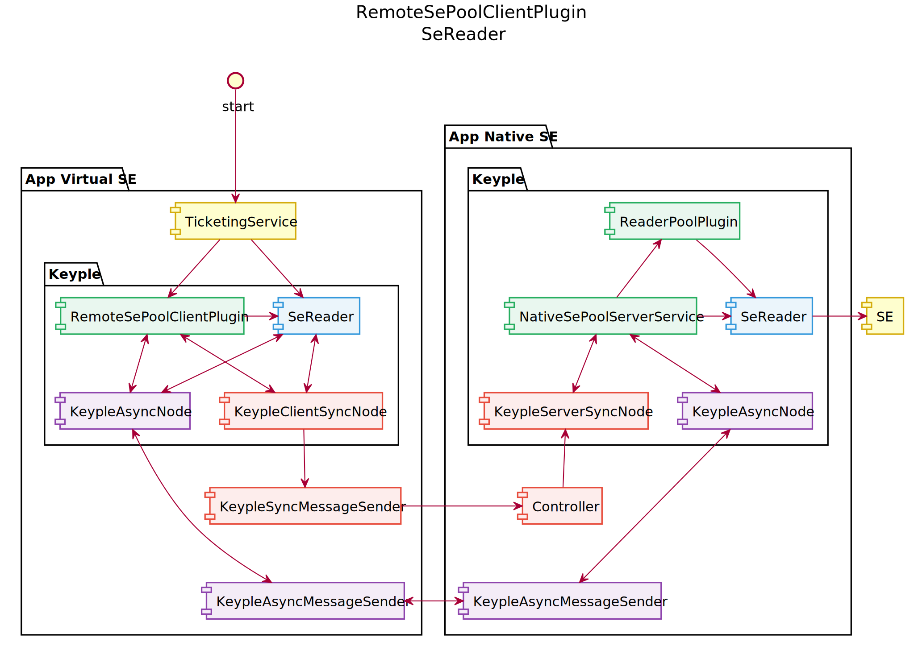

## Public Global API

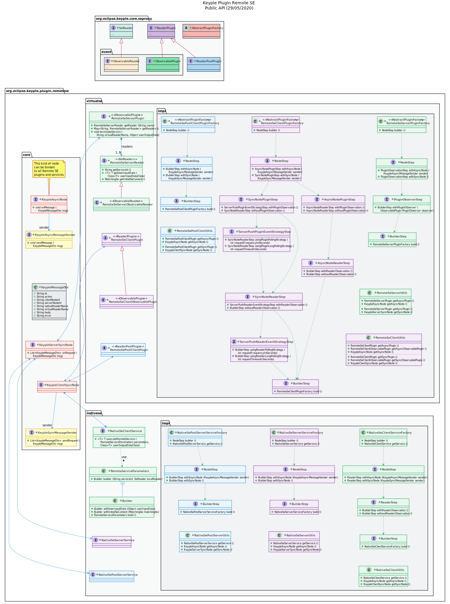

## Network configuration

Usually distributed architecture will rely on a TCP/IP network to communicate. It is up to the users to choose which protocol to use on top of it. The Remote SE Plugin does not provide the network implementation, but it provides a set of interfaces to be implemented.

### Full-Duplex Asynchronous communication

If you want to implement a Full-Duplex communication protocol, such as Web Sockets for example, then you should use the `KeypleAsyncNode` node and should provide two implementations of the `KeypleAsyncMessageSender` interface, one client side, and another one server side.

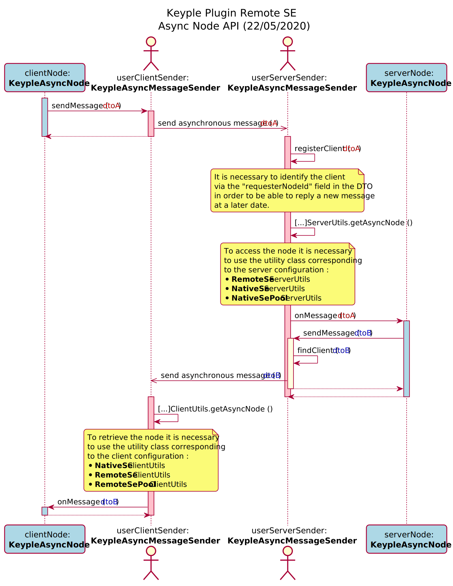

### Client-Server Synchronous communication

If you want to implement a Client-Server communication protocol, such as standard HTTP for example, then you should use client side the `KeypleClientSyncNode` node by providing an implementation of the `KeypleSyncMessageSender` interface, and server side the `KeypleServerSyncNode` node.

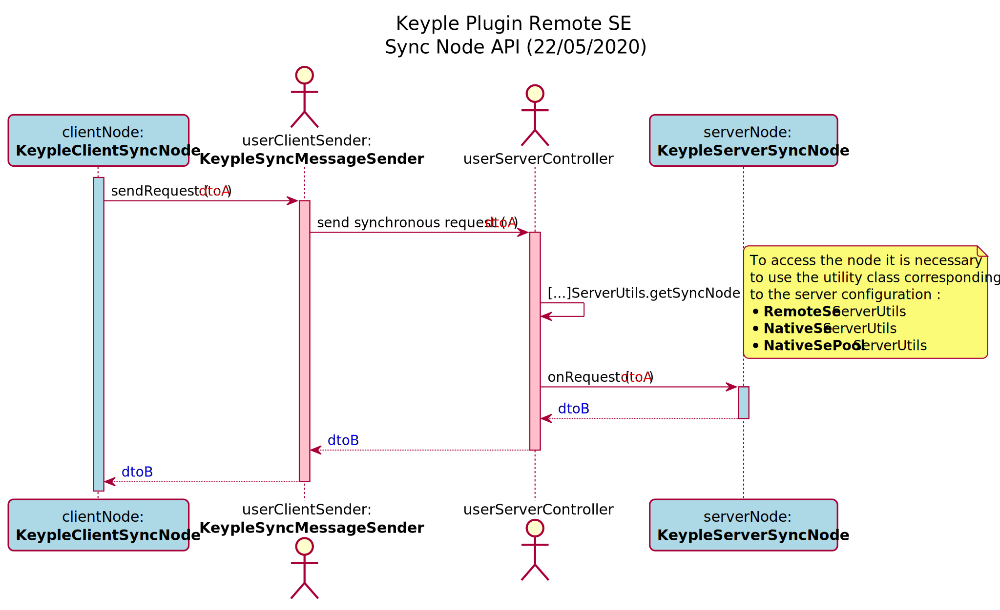

## Exchanged data

The object `KeypleMessageDto` contains data exchanged between **Native SE** and **Virtual SE** components. It is built and processed by the plugin and you don't need to modified it.

## Annexes

### Remote SE Server Plugin API (class diagram)

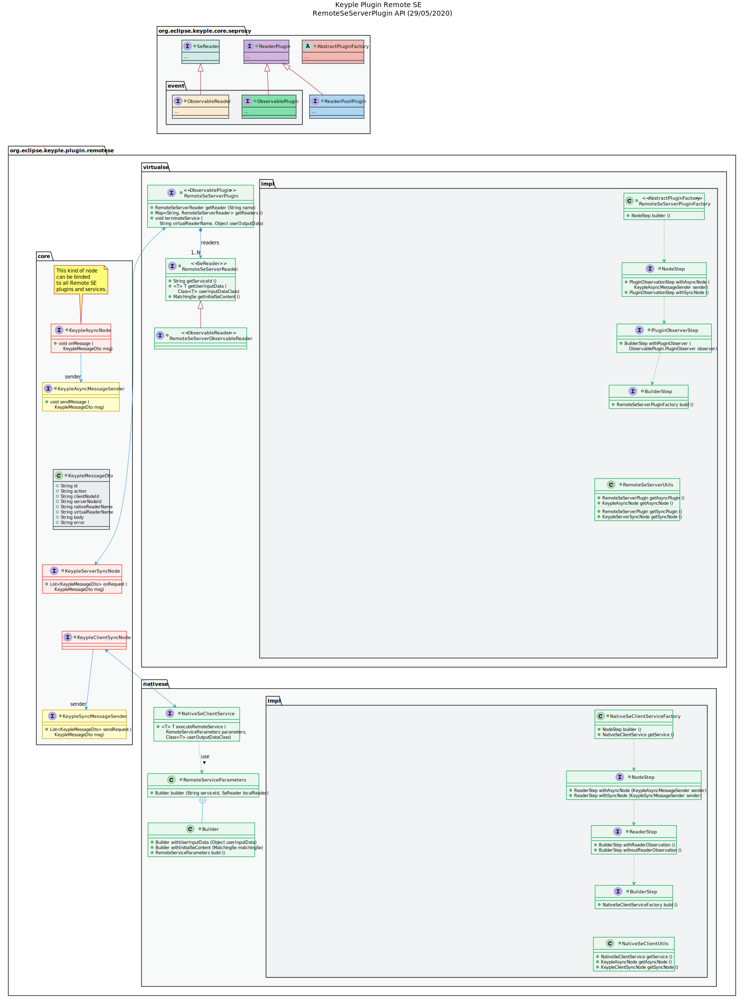

### Remote SE Client Plugin API (class diagram)

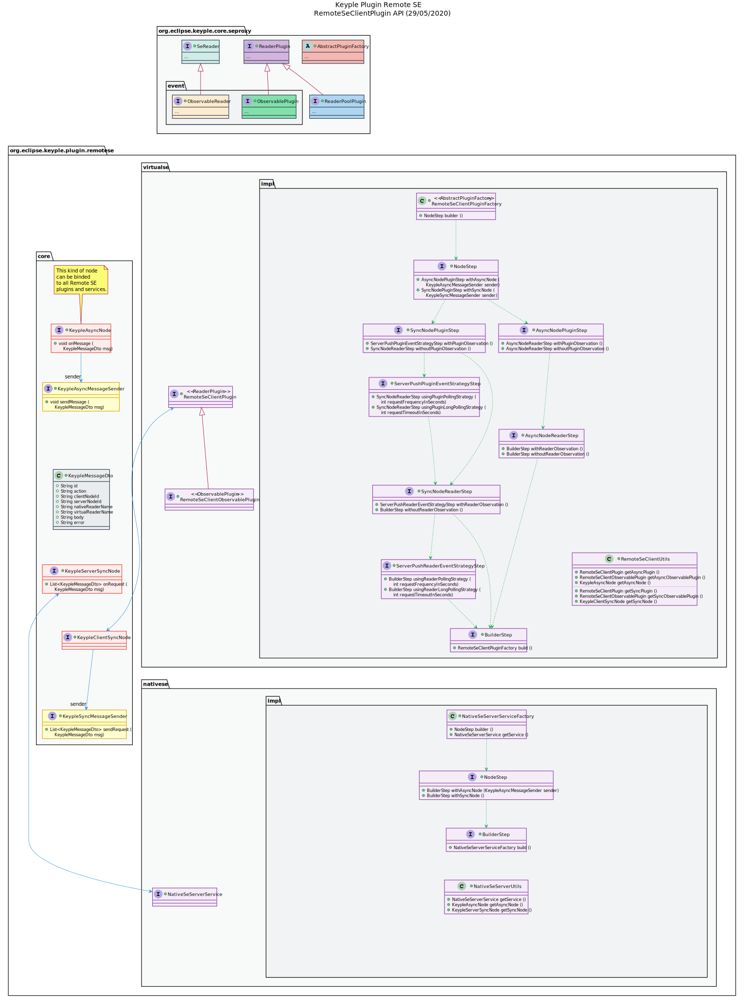

### Remote SE Pool Client Plugin API (class diagram)

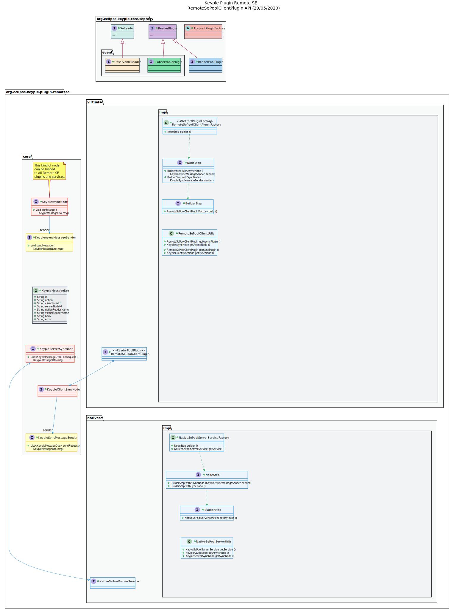

### Remote SE Server Plugin (sequence diagram)

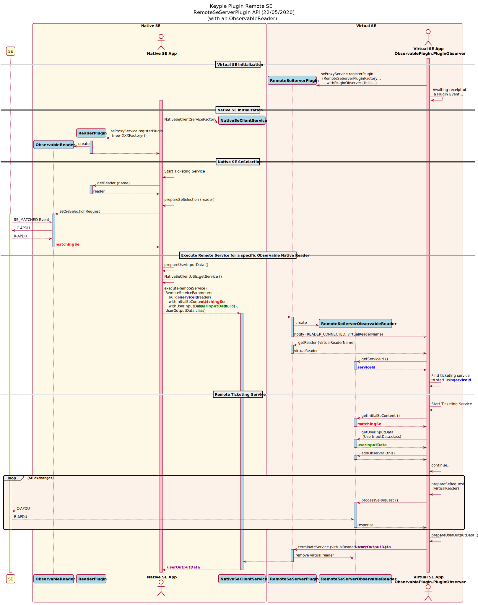
