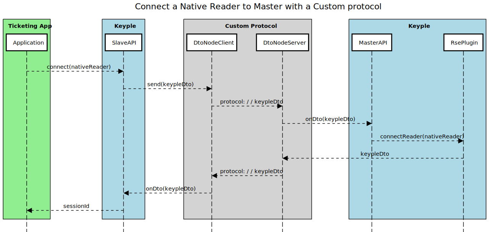
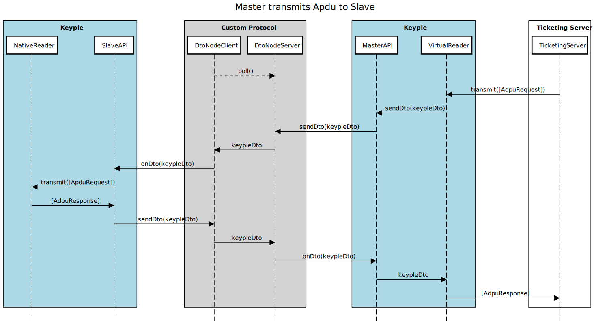

# Remote Secure Element Plugin

The Remote SE Plugin allows a terminal to communicate with a "remote" Se Reader plugged into a another terminal. 

In a Calypso context, it is useful when your SAM reader is and your PO reader are not connected to the same terminal. With the remote se plugin, you can open Calypso transaction within a distributed architecture.

## How it works

A terminal (let's identify it terminal1) wants to communicate with another terminals reader (terminal2). To give access to it's native reader, terminal2 should open a session to terminal1 via ``SlaveAPI#connect()`` method. Doing this, terminal1 receives control of the reader. terminal2 is identified as the slave and terminal1 as the master.

When terminal2 (slave) opens sucessfully a session to terminal1 (master), a ``VirtualReader`` is created on terminal1' side. This ``VirtualReader`` is viewed as a local reader for the master, in fact it acts as a proxy to the ``SeReader`` on terminal2.

## Network configuration

Usually distributed architecture will rely on a TCP/IP network to communicate. It is up to the users to choose which protocol to use on top of it. The remote se plugin does not provide the network implementation, but it provides a set of interfaces to be implemented

Examples of implementation can be found in example/calypso/remotese/transport

## Transport implementation

### KeypleDto

``KeypleDto`` is the object that contains the information about the remote invocation, they are built and processed by the plugin, there is no need to modify them.

Users needs to implement (and personalize if needed) ``TransportDto`` which is an envelop for a KeypleDto. It allows to enrich a KeypleDto with information on the transport implementation to allow back and forth communication. (for instance a callback url)

### DtoNode

``DtoNode`` is a convenient interface, it links a ``DtoSender`` with a ``DtoHandler`` to create a unique point of contact.

#### DtoSender

``DtoSender`` is the component responsible for sending the TransportDto to the other terminal.
 
#### DtoHandler

``DtoHandler`` interface is implemented by both ``SlaveAPI`` (Slave side) and ``MasterAPI`` (Master side). Both services waits for a KeypleDto, process it, and will return a KeypleDto as a response (if any). You should link a ``DtoNode`` to both ``SlaveAPI`` and ``MasterAPI`` to make them communicate.
